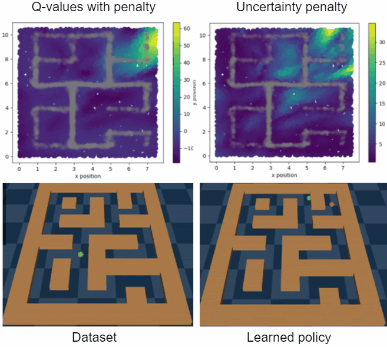

# PEBL: Pessimistic Ensembles for Offline Deep Reinforcement Learning
Code accompanying "PEBL: Pessimistic Ensembles for Offline Deep Reinforcement Learning" by Jordi Smit, Canmanie T. Ponnambalam, Matthijs T. J. Spaan, Frans A. Oliehoek.

The optimization related code for the PEBL DQN algorithm can be found [here](https://github.com/j0rd1smit/PEBL/blob/main/src/agents/PEBLDQN.py#L219), while this code can be found [here](https://github.com/j0rd1smit/PEBL/blob/main/src/agents/PEBLSAC.py#L272) for the PEBL SAC algorithm.

## Abstract
Offline reinforcement learning (RL), or learning from a fixed data set, is an attractive alternative to online RL.
Offline RL promises to address the cost and safety implications of taking numerous random or bad actions online, a crucial aspect of traditional RL that makes it difficult to apply in real-world problems. 
However, when RL is naïvely applied to a fixed data set, the resulting policy may exhibit poor performance in the real environment. 
This happens due to over-estimation of the value of state-action pairs not sufficiently covered by the data set. 
A promising way to avoid this is by applying pessimism and acting according to a lower bound estimate on the value. 
In deep reinforcement learning, however, uncertainty estimation is highly non-trivial and development of effective uncertainty-based pessimistic algorithms remains an open question.
This paper introduces two novel offline deep RL methods built on Double Deep Q-Learning and Soft Actor-Critic. 
We show how a multi-headed bootstrap approach to uncertainty estimation is used to calculate an effective pessimistic value penalty. 
Our approach is applied to benchmark offline deep RL domains, where we demonstrate that our methods can often beat the current state-of-the-art.

## Demo

A visualization of our Maze2D expirements.
In this experiment, the agents must learn a continuous action policy that can move a ball from any point in a maze to a pre-specified point. 
The data set used in this task consist of random routes through the maze. 
Thus, the agent must stitch together different trajectories to learn the shortest path to the goal location from every possible starting point. 
The gray areas in both figures indicate the number of data points available in the data set per location. 
Note that the agent only observes its x and y coordinates and speeds, and still, the agent can learn where the walls are located using its own uncertainty.
## Run Locally

Clone the project

### Install
All the requirements for the MinAtar expirements should be pip installable.
```bash
pip install -r requirements.txt
```
For the D4RL experiments we assume you have setup MuJoCo and D4RL yourself since this cannot be done using pip alone.
Please see the following links for instructions:
- [D4RL setup](https://github.com/rail-berkeley/d4rl#setup);
- [MuJoCo setup](https://github.com/openai/mujoco-py#install-mujoco);

### Run experiments
The PEBL DQN agent can be trained using:
```bash
python train_pebldqn.py \
  --env_name ENV_NAME \
  --eps EPS \
  --dataset_size DATASET_SIZE \
  --max_steps MAX_STEPS \
  --gpu GPU \
  --seed SEED\
```
| Parameter | Type     | Description                |
| :-------- | :------- | :------------------------- |
| `ENV_NAME` | `string` | Specifies the environment to be used in the experiment. It has two options: `SpaceInvaders-MinAtar-chw-v0` and `Breakout-MinAtar-chw-v0`. |
| `EPS` | `float` | The eps value to be used in the eps-greedy data collection strategy. |
| `DATASET_SIZE` | `int` | The amount transitions that should be gathered using the eps-greedy strategy. |
| `max_steps` | `int` | The amount of gradient steps to take. |
| `GPU` | `boolean` | If set to True the training process with use a GPU. |
| `SEED` | `int` | Set the training process's random seed. Experiments in the paper used the seed `0,1,2`.  |

The PEBL SAC agent can be trained on the D4RL gym and maze-2d benchmarks using:
```bash
python train_peblsac.py \
  --env_name.py \
  --env_name ENV_NAME \
  --gpu GPU \
  --seed SEED\
```
| Parameter | Type     | Description                |
| :-------- | :------- | :------------------------- |
| `ENV_NAME` | `string` | Specifies the environment to be used in the experiment. Use the `--help` flag for an overview of all the options.|
| `GPU` | `boolean` | If set to True the training process with use a GPU. |
| `SEED` | `int` | Set the training process's random seed. Experiments in the paper used the seed `0`.  |
  
  